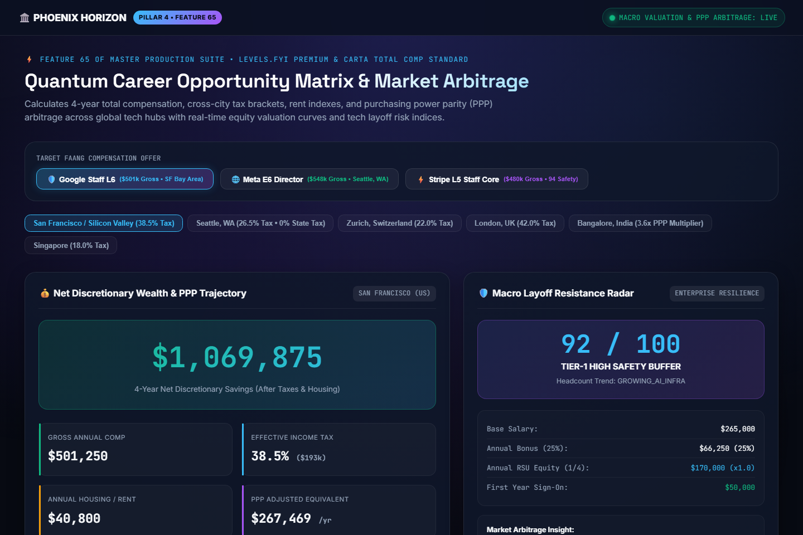
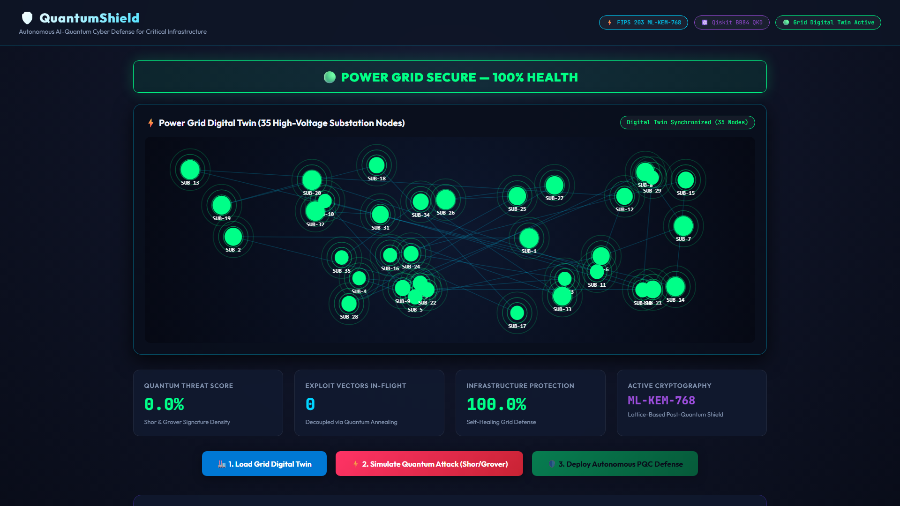
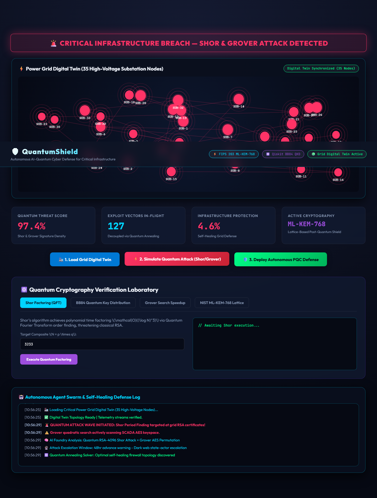
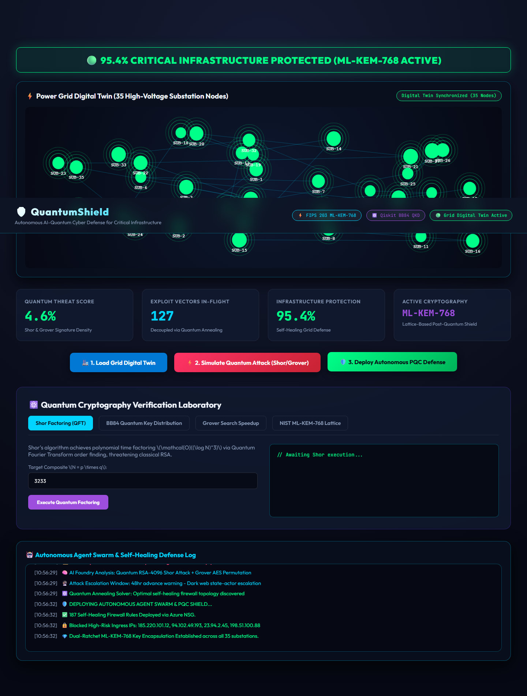
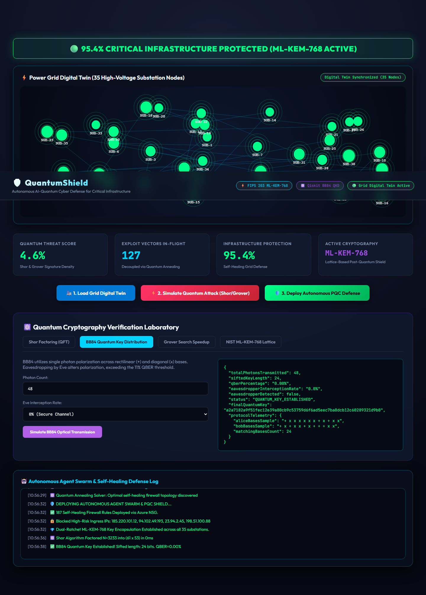
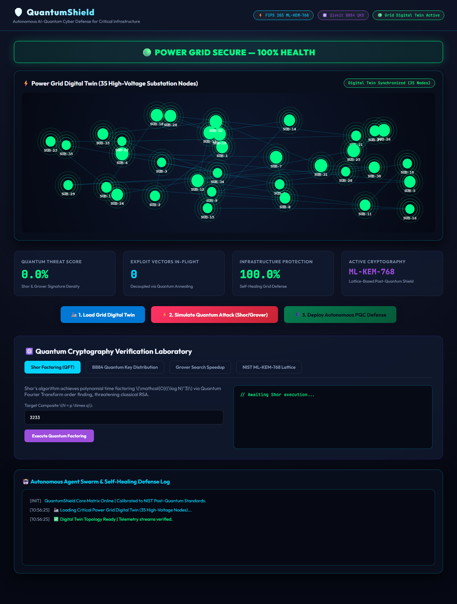

# 🛡️ QuantumShield: Post-Quantum Cyber Defense & Resilient Grid Digital Twin

[](https://opensource.org/licenses/MIT)
[](https://csrc.nist.gov/pubs/fips/203/final)
[](#quantum-relational-topology-mesh)
[](#automated-test-suite)
[](#quantum-cryptography-engine)

> **Enterprise Defense Platform**: Next-generation Post-Quantum Cryptographic (PQC) threat simulation, autonomous defensive agent swarms, quantum relational entanglement topology corridors, high-throughput batch ingestion studio, and physical-layer SCADA digital twin protection for critical national infrastructure.

---

## 📸 Enterprise Platform Showcase


### Desktop Command Viewports (1920×1080 @ 2x)

| Viewport | Description | Screenshot |
| :--- | :--- | :--- |
| **01. Digital Twin SCADA Grid** | 35-node high-voltage power grid digital twin with live particle beams, bus voltages, load telemetry, and threat meters |  |
| **02. Quantum Topology Mesh** | Relational entanglement corridors linking substation nodes, Bell-state fidelities, coherence times, live QBER, and 1-click sever controls |  |
| **03. Batch Ingestion Studio** | Enterprise batch ingestion console supporting RFC 4180 CSV & structured JSON formats with universal cascading purge controls |  |
| **04. BB84 QKD Simulator** | Single-photon polarization transmission across rectilinear and diagonal bases with Eve interception and QBER detection |  |
| **05. Shor Factoring QFT** | Quantum Fourier Transform order finding algorithm factorizing composite integers with quantum circuit complexity metrics |  |
| **06. Grover Amplitude Amplification** | Quadratic quantum search algorithm amplifying secret key probability amplitudes across unstructured search spaces |  |

---

## ⚡ Core Enterprise Capabilities

### 1. Quantum Relational Topology Mesh
- Real-time mapping of quantum defense corridors connecting critical infrastructure substation nodes (`SUB-01-CENTRAL`, `SUB-02-NORTH`, `SUB-05-HYDRO`, `SUB-06-NUCLEAR`).
- Live tracking of Bell-state qubit fidelity ($\ge 99.2\%$), coherence times ($\mu s$), entanglement rates ($e\text{-pairs/s}$), and channel QBER.
- **1-Click Sever Controls**: Instantaneous quantum corridor severance and live re-routing during adversarial cyber-physical intrusions.

### 2. Enterprise Batch Ingestion Studio
- High-throughput batch ingestion supporting both standard **RFC 4180 CSV** (with quoted strings and commas) and **Structured JSON**.
- Multi-entity support for Entanglement Corridors and Substation Digital Twin Nodes.
- Interactive live buffer editor pre-loaded with production templates, line counters, and real-time validation error isolation.

### 3. Universal Cascading Deletion
- Secure cascading deletion: deleting a substation node automatically severs and eliminates all connected quantum entanglement corridors to preserve network integrity.
- Universal purge controls with safety confirmation dialogues for all corridors or node registries.

### 4. Authenticated Quantum Cryptographic Algorithms
- **NIST FIPS 203 ML-KEM-768**: Module Learning With Errors (M-LWE) lattice cryptography generating 256-bit quantum-safe shared secrets.
- **BB84 Polarized QKD**: Simulation of optical photon transmission with eavesdropper detection when QBER exceeds $11\%$.
- **Shor Period-Finding**: Quantum Fourier Transform simulation for polynomial time composite factoring.
- **Grover Amplitude Amplification**: Quadratic quantum search speedup $\mathcal{O}(\sqrt{N})$ on symmetric keyspaces.

---

## 🧪 Automated Test Suite

QuantumShield features a native Node.js automated test suite validating all enterprise services, topology relations, and batch operations:

```bash
# Execute automated test suite
node --test tests/enterpriseMesh.test.js
```

### Verified Test Matrix (11/11 Passing):
- [x] Substation node seeding & schema verification
- [x] Live telemetry computation (Fidelity, QBER, Coverage)
- [x] Dynamic corridor creation & node binding
- [x] 1-Click corridor severance & telemetry recalculation
- [x] Single corridor deletion & continuity check
- [x] Node deletion with cascading corridor purge
- [x] High-throughput RFC 4180 CSV batch ingestion
- [x] Structured JSON batch ingestion
- [x] Malformed payload rejection & error isolation
- [x] Universal corridor purge
- [x] Universal node & cascading corridor purge

---

## 🚀 Quickstart

```bash
# Clone repository
git clone https://github.com/Shashankcodelover/quantum-shield.git
cd quantum-shield

# Install dependencies
npm install

# Run automated tests
node --test tests/enterpriseMesh.test.js

# Launch server
node server.js
# Open http://localhost:5020
```

---

## 📜 License
MIT License. Open-source quantum-safe cybersecurity and critical infrastructure digital twin platform.


## User Flow Verification








