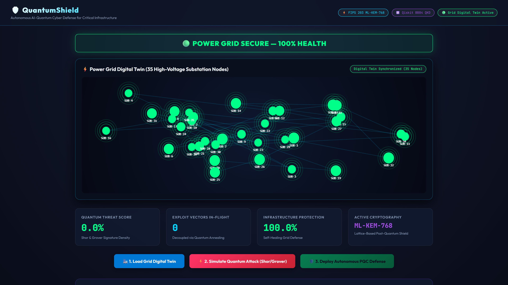
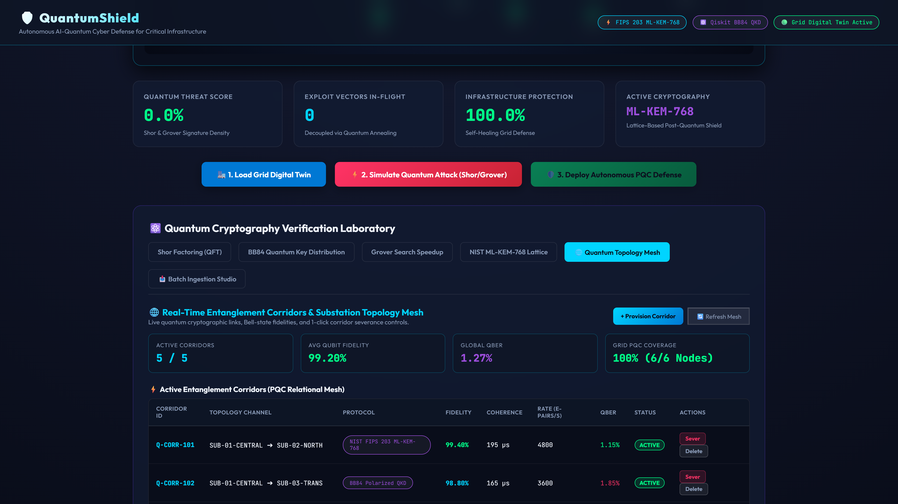
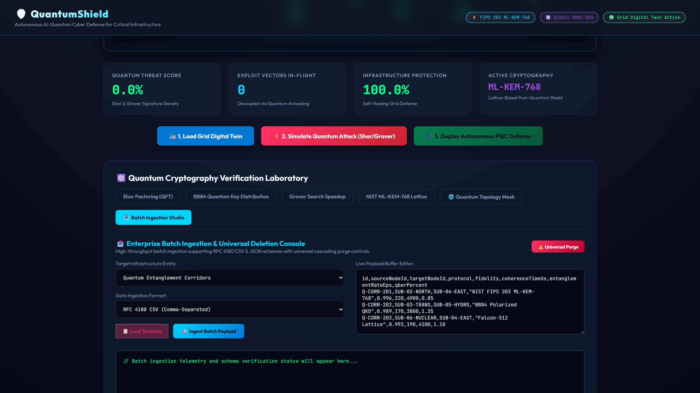
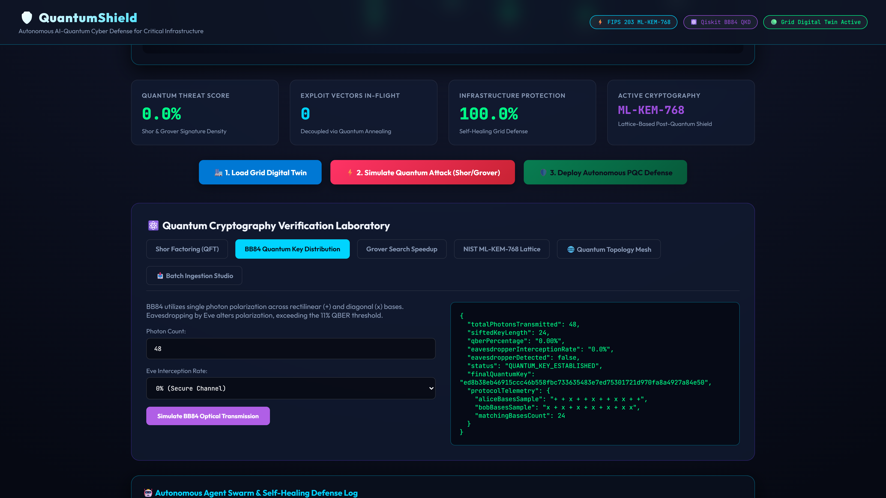
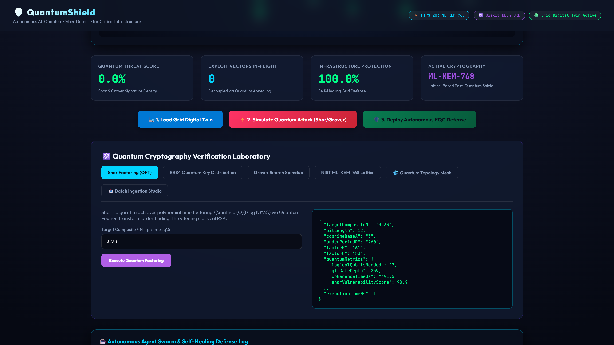
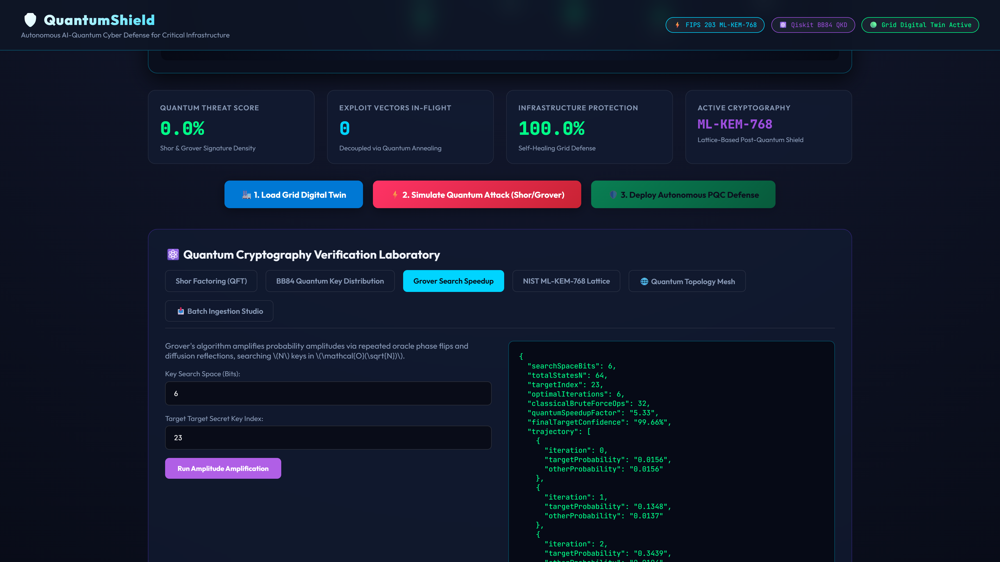

# 🛡️ QuantumShield

QuantumShield is a cybersecurity simulation platform and interactive dashboard that demonstrates quantum computing attack vectors and post-quantum cryptographic defense concepts. The application pairs a Node.js Express server with an interactive HTML5 Canvas frontend, cryptographic algorithm simulators, an in-memory network topology service, and an automated test suite.

## 📸 Screenshots

| Interface View | Description | Screenshot |
| :--- | :--- | :--- |
| **Grid Digital Twin** | Interactive 35-node power grid rendered on HTML5 Canvas with node rotation, attack states, and particle animations. |  |
| **Topology Mesh** | In-memory corridor and substation node management with live telemetry metrics and 1-click sever controls. |  |
| **Batch Ingestion Studio** | High-throughput batch ingestion supporting RFC 4180 CSV and JSON formats with universal purge controls. |  |
| **BB84 QKD Simulator** | Single-photon polarization simulation across rectilinear and diagonal bases with Eve intercept-resend modeling and QBER threshold detection. |  |
| **Shor Factoring (QFT)** | Classical simulation of order-finding to factor composite integers with logical qubit and gate depth estimations. |  |
| **Grover Search** | Two-state amplitude amplification simulation computing oracle inversion and diffusion probability trajectories. |  |

## ⚙️ Features (Ground Truth)

### 1. Cryptographic Algorithm Simulators (`quantum_engine.js`)
- **Shor's Factoring**: Simulates the quantum order-finding subroutine classically ($a^r \equiv 1 \pmod N$) with trial division fallback, calculating logical qubit requirements and QFT gate depth metrics.
- **Grover's Amplitude Amplification**: Computes state-vector amplitude trajectories step-by-step using oracle reflection and diffusion operators for user-specified bit sizes and target indices.
- **BB84 Quantum Key Distribution (QKD)**: Simulates photon polarization in rectilinear (`+`) and diagonal (`x`) bases, models Eve eavesdropping (intercept-resend state collapse), computes Quantum Bit Error Rate (QBER), detects eavesdropping when QBER exceeds 11%, and derives SHA-256 quantum keys for valid exchanges.
- **ML-KEM-768 Specification Mock**: Generates pseudorandom byte sequences matching NIST FIPS 203 parameter sizes (1184-byte public key, 2400-byte private key, 1088-byte ciphertext, 32-byte shared secret).

### 2. Network Topology Service (`quantumTopologyService.js`)
- **In-Memory Store**: Seeds and maintains 6 mock substation nodes and 5 entanglement corridors.
- **CRUD Operations**: Provides endpoints to create, inspect, and delete nodes and corridors.
- **Corridor Controls**: Supports 1-click corridor severance and restoration (`/sever`, `/restore`).
- **Cascading Deletion**: Deletes all attached corridors automatically when a substation node is removed.
- **Batch Ingestion**: Parses both RFC 4180 CSV (handling quotes and commas) and structured JSON for bulk corridor and node creation.
- **Telemetry Calculation**: Computes active and severed corridor counts, average fidelity, global QBER, and node coverage percentages.
- **Universal Purge**: Provides endpoints to purge all corridors or all nodes.

### 3. Interactive Web Dashboard (`index.html`)
- **Canvas Grid Digital Twin**: Renders an interactive 35-node power grid on HTML5 Canvas with mouse-reactive rotation, pulsating energy rings, and click-to-inspect node details.
- **Attack & Defense State Transitions**: Toggles simulated threat states, displays explosion particle effects, and updates defense metrics.
- **Laboratory Tabs**: Provides interactive UI panels for Shor factoring, BB84 simulation, Grover search, ML-KEM parameters, topology mesh management, batch ingestion, and simulated neural sweeps.
- **Event Logging Console**: Displays timestamped logs of simulation and user actions.

### 4. Optional Python Components
- **Streamlit Console (`dashboard.py`)**: Connects to the Express server to visualize threat metrics and run Shor, BB84, and ML-KEM operations.
- **FastAPI Service (`main.py`)**: Standalone backend offering Qiskit 4-qubit circuit simulation (`/quantum/keygen`), Ollama Phi-3 prompt scanning (`/scan/threat`), and WebSocket broadcasting (`/ws/threat-monitor`).

## 🧪 Automated Test Suite

The project includes an automated test suite executed with Node's native test runner (`node:test`):

```bash
node --test tests/enterpriseMesh.test.js
```

### Verified Tests (11/11 Passing):
- Substation node seeding and schema validation
- Live telemetry calculation (fidelity, QBER, coverage)
- Corridor provisioning and node binding
- 1-click corridor severance and restoration
- Single corridor deletion and continuity
- Substation deletion with cascading corridor deletion
- RFC 4180 CSV batch ingestion
- Structured JSON batch ingestion
- Error rejection for malformed batch payloads
- Universal corridor purge
- Universal node and cascading corridor purge

## 🚀 Quickstart

### Prerequisites
- Node.js >= 18.0.0

### Running the Server

```bash
# Install dependencies
npm install

# Run automated tests
node --test tests/enterpriseMesh.test.js

# Start the Express server
node server.js
```

Open `http://localhost:5020` in your web browser.

### Running Optional Python Dashboard

```bash
pip install streamlit requests
streamlit run dashboard.py
```
